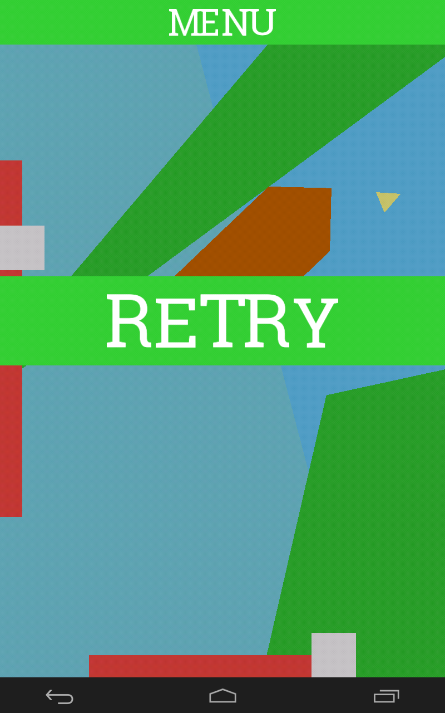
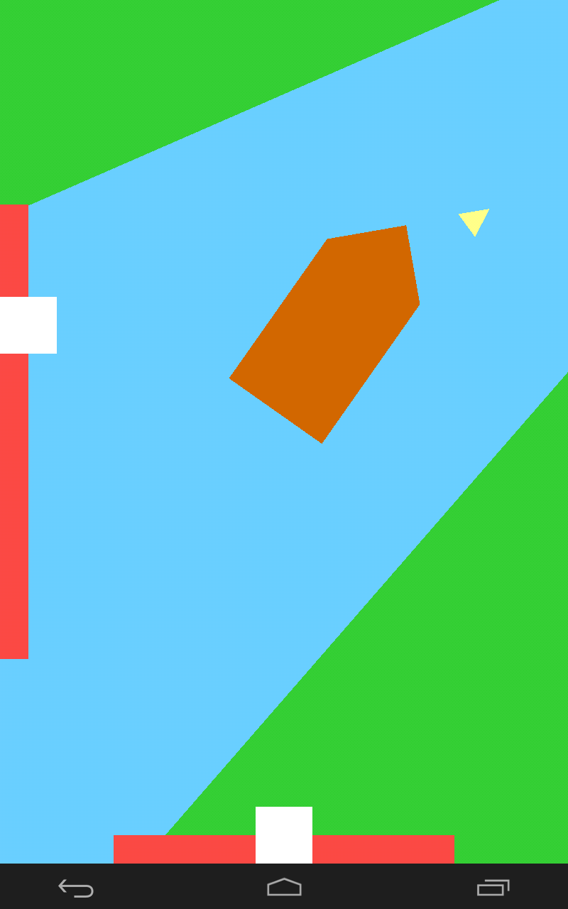
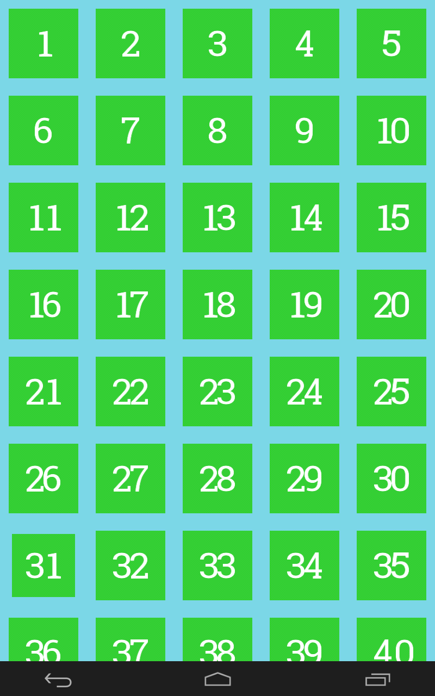
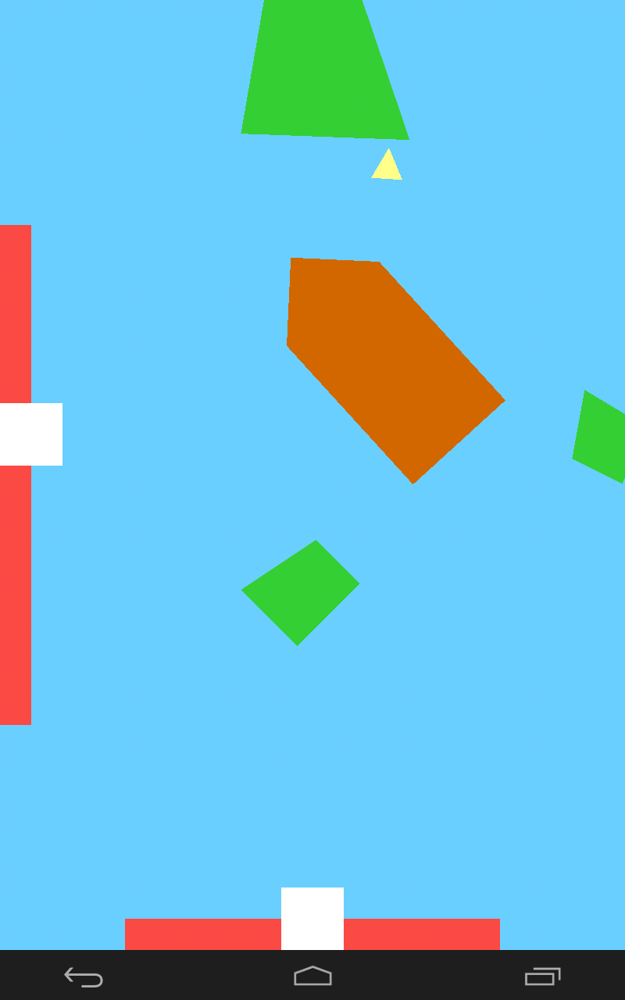

# Boat Game
A fun game built for Android using simple shapes and polygons.
Also works on desktop and comes with a level editor.
## How-to
 Control the boat using the controls on the left and bottom of the screen.
 Navigate through around islands and treacherous waters and dock your boat
 safely in the yellow area!

## Importing to Android studio
Simply clone the repository and import it into Android Studio.
Do not update Gradle as this would interfere with Libgdx.

IOS and HTML builds are untested.

## Using the level editor
A level editor has been made using python and pygame. The python
file is placed inside the Level Editor directory. You can add your
own levels by copying the contents of the level editor outputs into json
files in the `\android\assets` directory.
#### Short cuts
```
LEFT_CLICK - Add a vertex in for a land or wave polygon
RIGHT_CLICK - Move the Dock
P - Output level data
ESC - Stop the work on current polygon
BKSPC - Delete current polygon
1 - Land polygon mode
2 - Water polygon mode
```
## Screen Shots




## About
This game is written in java using [Libgdx]("https://libgdx.badlogicgames.com/").
## Author
Kenta Tellambura - Software Engineering Student U of A
